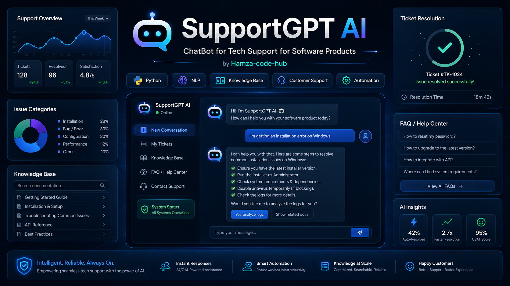
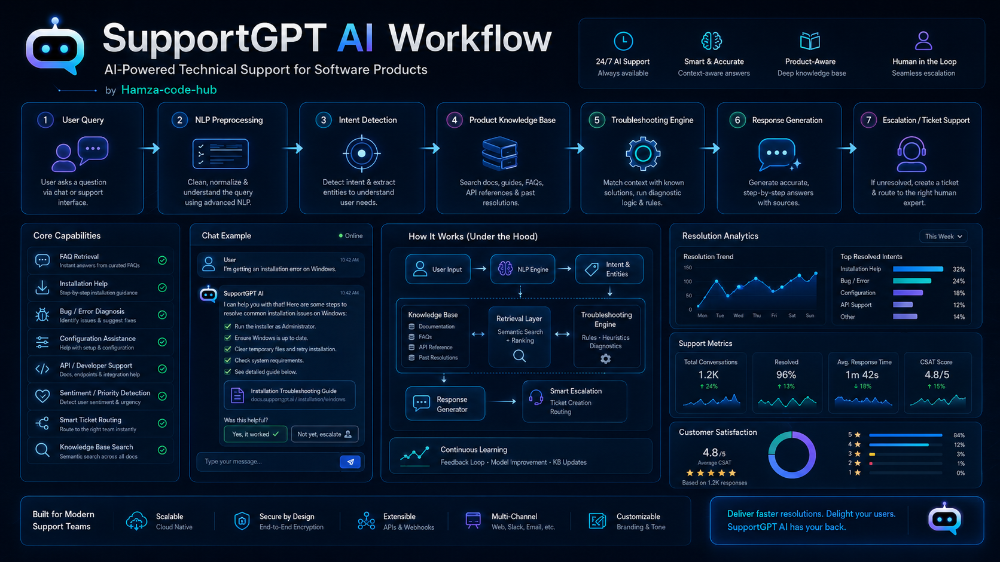
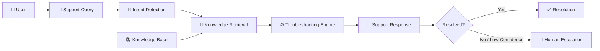

<div align="center">



<br>

# 🤖 SupportGPT AI

## Intelligent Technical Support for Software Products

<p>
A modular <strong>AI-powered technical support platform</strong> combining
<strong>NLP, intent detection, knowledge-base retrieval, automated troubleshooting,
smart escalation, REST APIs and an interactive support interface</strong>.
</p>

<br>


<br>


<br>

### `Technical Support` • `NLP` • `Knowledge Retrieval` • `Troubleshooting` • `Automation`

<br>

[](https://github.com/Hamza-code-hub)

</div>

---

> [!NOTE]
> The interface artwork in this README is a conceptual visualization of the intended product experience.
> Metrics shown inside the artwork are illustrative unless reproduced by an implemented analytics pipeline.

---

# ✨ Overview

**SupportGPT AI** is an intelligent technical-support assistant designed to help users troubleshoot software-product issues through a structured support workflow.

Instead of operating as a simple question-and-answer chatbot, the platform is designed around:

```text
User Problem
     │
     ▼
NLP Processing
     │
     ▼
Intent Detection
     │
     ▼
Knowledge Retrieval
     │
     ▼
Troubleshooting Engine
     │
     ▼
Contextual Response
     │
     ├── Resolved
     │
     └── Escalate
              │
              ▼
        Human Support
```

The project explores how AI and retrieval techniques can reduce repetitive support work while keeping difficult or low-confidence cases eligible for human escalation.

---

# 🌟 Product Vision

Traditional support systems often force users through:

```text
Search Documentation
        ↓
Read Multiple Articles
        ↓
Try Different Fixes
        ↓
Open Support Ticket
        ↓
Wait for Response
```

SupportGPT AI explores a more direct workflow:

```text
Describe the Problem
        ↓
Understand Intent
        ↓
Retrieve Relevant Knowledge
        ↓
Generate Troubleshooting Guidance
        ↓
Confirm Resolution
        ↓
Escalate When Necessary
```

---

# 🚀 Core Capabilities

<table>
<tr>
<td width="50%">

### 💬 Conversational Support

Users can describe software problems using natural language instead of navigating complex documentation trees.

</td>

<td width="50%">

### 🧠 Intent Detection

The system identifies common technical-support categories such as:

- Installation
- Bugs / errors
- Configuration
- API support
- Performance
- Account access

</td>
</tr>

<tr>
<td>

### 📚 Knowledge-Base Retrieval

Relevant documentation and troubleshooting articles are ranked against the user's query.

</td>

<td>

### 🛠️ Guided Troubleshooting

The support engine returns structured, step-by-step actions instead of only generic conversational text.

</td>
</tr>

<tr>
<td>

### 🎯 Confidence-Aware Responses

Retrieval confidence can be used to distinguish stronger matches from uncertain support cases.

</td>

<td>

### 🎫 Smart Escalation

Low-confidence or unresolved problems can be flagged for human support rather than pretending the automated answer is reliable.

</td>
</tr>

<tr>
<td>

### 🔌 REST API

A FastAPI service exposes SupportGPT functionality for integration with websites, software products, mobile applications, or helpdesk systems.

</td>

<td>

### 🖥️ Interactive Support UI

A Streamlit interface provides an immediately runnable demonstration of the support workflow.

</td>
</tr>
</table>

---

# 🧬 End-to-End Workflow

<div align="center">



</div>

The intended support pipeline is:

```text
01
USER QUERY
    │
    ▼
02
NLP PREPROCESSING
    │
    ▼
03
INTENT DETECTION
    │
    ▼
04
PRODUCT KNOWLEDGE BASE
    │
    ▼
05
TROUBLESHOOTING ENGINE
    │
    ▼
06
RESPONSE GENERATION
    │
    ▼
07
RESOLUTION / ESCALATION
```

---

# 🏗️ Architecture



---

# 🧠 Under the Hood

The reference implementation intentionally starts with a lightweight local architecture:

```text
                  User Query
                       │
                       ▼
                Intent Detector
                       │
                       ▼
             TF-IDF Vectorization
                       │
                       ▼
             Cosine Similarity
                       │
                       ▼
              Ranked KB Articles
                       │
                       ▼
              Support Response
                       │
                       ▼
             Confidence Threshold
                  ┌────┴─────┐
                  ▼          ▼
               Answer     Escalate
```

This baseline has several advantages:

- No paid API required
- Runs locally
- Deterministic behavior
- Easy to test
- Easy to understand
- Easy to replace with embeddings or an LLM later

---

# 🔍 Intent Categories

The starter implementation detects several technical-support intents.

| Intent | Typical Queries |
|---|---|
| 📦 **Installation** | Installer errors, dependencies, setup problems |
| 🐛 **Bug / Error** | Exceptions, crashes, failed operations |
| ⚙️ **Configuration** | Environment, settings, config files |
| 🔌 **API Support** | Authentication, endpoints, tokens, integrations |
| ⚡ **Performance** | Latency, memory, CPU, slow application |
| 🔐 **Account** | Login, password reset, credentials |
| 💬 **General** | Other technical-support questions |

---

# 📚 Knowledge Base

Support articles are stored in:

```text
data/knowledge_base.json
```

Example structure:

```json
{
  "id": "KB-001",
  "title": "Windows Installation Troubleshooting",
  "category": "installation",
  "keywords": [
    "windows",
    "installation",
    "installer"
  ],
  "summary": "Common Windows installation problems and their causes.",
  "steps": [
    "Download the latest installer.",
    "Run it as Administrator.",
    "Verify dependencies.",
    "Review installation logs."
  ]
}
```

This makes the knowledge layer:

```text
Readable
    +
Version Controlled
    +
Searchable
    +
Extensible
```

---

# 🔎 Retrieval Pipeline

The initial retrieval layer uses:

```text
User Query
    │
    ▼
TF-IDF
    │
    ▼
Query Vector
    │
    ▼
Cosine Similarity
    │
    ▼
Knowledge Article Ranking
    │
    ▼
Top-K Results
```

The architecture can later be upgraded to:

```text
TF-IDF
   │
   ▼
Sentence Embeddings
   │
   ▼
Vector Database
   │
   ▼
Hybrid Retrieval
   │
   ▼
RAG
```

---

# 🛠️ Troubleshooting Response

A support response contains more than plain chat text.

Example structure:

```json
{
  "intent": "installation",
  "answer": "Most Windows installation problems...",
  "steps": [
    "Download the latest installer.",
    "Run the installer as Administrator.",
    "Verify system requirements."
  ],
  "source": {
    "id": "KB-001",
    "title": "Windows Installation Troubleshooting"
  },
  "confidence": 0.72,
  "escalation_recommended": false
}
```

This structure makes the engine easier to integrate into:

- Web applications
- Mobile apps
- Support portals
- Helpdesk systems
- Slack / Teams bots
- Product dashboards

---

# 🎫 Confidence & Escalation

A technical-support system should not pretend every answer is correct.

SupportGPT therefore uses a simple escalation concept:

```text
Retrieved Answer
      │
      ▼
Confidence Score
      │
  ┌───┴───────────┐
  │               │
High            Low
  │               │
  ▼               ▼
Answer       Escalation
                │
                ▼
          Human Support
```

This provides a foundation for a **human-in-the-loop** support architecture.

---

# 📁 Repository Structure

```text
SupportGPT-AI-Tech-Support/
│
├── .github/
│   └── workflows/
│       └── bootstrap-project.yml
│
├── assets/
│   ├── supportgpt-ai-dashboard.png
│   └── supportgpt-ai-workflow.png
│
├── data/
│   └── knowledge_base.json
│
├── notebooks/
│   └── tech_support_chatbot.ipynb
│
├── src/
│   └── supportgpt/
│       ├── __init__.py
│       ├── config.py
│       ├── intent.py
│       ├── knowledge_base.py
│       ├── retrieval.py
│       ├── engine.py
│       └── cli.py
│
├── tests/
│   ├── test_intent.py
│   └── test_engine.py
│
├── api.py
├── app.py
├── requirements.txt
├── pyproject.toml
├── .gitignore
└── README.md
```

---

# 🛠️ Technology Stack

| Technology | Purpose |
|---|---|
| 🐍 **Python** | Core application |
| 🧠 **NLP** | Query understanding |
| 🔎 **Scikit-learn** | TF-IDF & similarity retrieval |
| ⚡ **FastAPI** | REST API |
| 🎨 **Streamlit** | Interactive support interface |
| 📚 **JSON Knowledge Base** | Support content |
| 🧪 **PyTest** | Automated testing |
| 📓 **Jupyter** | Original experimentation |

---

# 🚀 Getting Started

## 1. Clone

```bash
git clone https://github.com/Hamza-code-hub/SupportGPT-AI-Tech-Support.git

cd SupportGPT-AI-Tech-Support
```

---

## 2. Create Environment

### Windows

```bash
python -m venv .venv

.venv\Scripts\activate
```

### Linux / macOS

```bash
python3 -m venv .venv

source .venv/bin/activate
```

---

## 3. Install

```bash
pip install -r requirements.txt

pip install -e .
```

---

# 💻 Run CLI

```bash
supportgpt
```

or:

```bash
python -m supportgpt.cli
```

Example:

```text
SupportGPT AI
Technical Support Assistant

You > My application installer fails on Windows.

SupportGPT >
Most Windows installation problems are caused by outdated
installers, insufficient permissions, missing dependencies,
or security software blocking setup.

Suggested steps:

1. Download the latest installer.
2. Run the installer as Administrator.
3. Verify system requirements.
4. Check required dependencies.
5. Review installation logs.
```

---

# 🖥️ Run Interactive Web App

```bash
streamlit run app.py
```

Streamlit will display the local URL in the terminal.

---

# 🔌 Run REST API

```bash
uvicorn api:app --reload --port 8000
```

API:

```text
http://localhost:8000
```

Interactive documentation:

```text
http://localhost:8000/docs
```

---

# ❤️ Health Check

```http
GET /health
```

Example response:

```json
{
  "status": "ok",
  "service": "SupportGPT AI"
}
```

---

# 💬 Chat API

```http
POST /chat
```

Request:

```json
{
  "message": "My API token returns a 401 error."
}
```

Response concept:

```json
{
  "intent": "api_support",
  "answer": "API authentication errors commonly result from...",
  "steps": [
    "Verify the API token.",
    "Check the Authorization header.",
    "Check token expiration."
  ],
  "confidence": 0.68,
  "escalation_recommended": false
}
```

---

# 🧪 Run Tests

```bash
pytest -q
```

The starter tests validate:

```text
Intent Detection
       +
Knowledge Retrieval
       +
Response Generation
       +
Confidence Range
```

---

# 📓 Original Notebook

The original research / experimentation notebook is preserved at:

```text
notebooks/tech_support_chatbot.ipynb
```

This keeps experimentation separate from the production-style application code.

---

# 🔬 Evolution Toward RAG

A natural next step is to evolve the current retrieval architecture into full Retrieval-Augmented Generation:

```text
User
 │
 ▼
Query Understanding
 │
 ▼
Hybrid Search
 │
 ├── Keyword Search
 │
 └── Vector Search
 │
 ▼
Relevant Documentation
 │
 ▼
LLM
 │
 ▼
Grounded Response
 │
 ▼
Citations
```

Potential additions include:

- Sentence Transformers
- FAISS
- Chroma
- Qdrant
- Elasticsearch
- OpenSearch
- LLM integration
- Hybrid search
- Citation-aware answers

---

# 🗺️ Roadmap

## ✅ Current Foundation

- [x] NLP intent detection
- [x] Local knowledge base
- [x] TF-IDF retrieval
- [x] Cosine-similarity ranking
- [x] Troubleshooting responses
- [x] Confidence scoring
- [x] Smart escalation flag
- [x] CLI
- [x] REST API
- [x] Streamlit interface
- [x] Automated tests

## 🧠 AI & RAG

- [ ] Sentence embeddings
- [ ] Vector database
- [ ] Hybrid retrieval
- [ ] RAG
- [ ] LLM response generation
- [ ] Source citations
- [ ] Conversation memory
- [ ] Multi-turn context
- [ ] Query rewriting

## 🎫 Helpdesk

- [ ] Ticket creation
- [ ] Ticket status
- [ ] Priority classification
- [ ] SLA monitoring
- [ ] Smart ticket routing
- [ ] Agent dashboard
- [ ] Conversation handoff

## 🔌 Integrations

- [ ] Slack
- [ ] Microsoft Teams
- [ ] Email
- [ ] Discord
- [ ] Zendesk
- [ ] Jira Service Management
- [ ] Webhooks

## 📊 Analytics

- [ ] Resolution rate
- [ ] First-response time
- [ ] Escalation rate
- [ ] Most common issues
- [ ] CSAT
- [ ] Knowledge gaps
- [ ] Agent performance analytics

---

# 🔐 Production Considerations

Before using the project in a production support environment, consider adding:

```text
Authentication
      +
Authorization
      +
Rate Limiting
      +
Audit Logging
      +
Encrypted Storage
      +
PII Protection
      +
Monitoring
      +
Human Escalation
```

Support responses should also be validated against the actual software product and documentation used by the organization.

---

# ⚠️ Disclaimer

> SupportGPT AI is currently a **research, educational, and portfolio project**.

The included sample knowledge base contains generic software-support information and should not be interpreted as official troubleshooting documentation for any specific commercial product.

---

# 👨‍💻 Author

<div align="center">

### Muhammad Hamza

**AI Developer • Software Engineering • NLP • Intelligent Automation**

<br>

[](https://github.com/Hamza-code-hub)

</div>

---

<div align="center">

# 🤖 SupportGPT AI

## Understand • Retrieve • Troubleshoot • Resolve

### Python × NLP × Knowledge Retrieval × Support Automation

<br>


<br>

### 💬 Ask → 🧠 Understand → 📚 Retrieve → 🛠️ Resolve

<br>

**Building intelligent support experiences that connect users with the right solution faster.**

<br>

⭐ **If this project is useful, consider starring the repository.**

</div>
